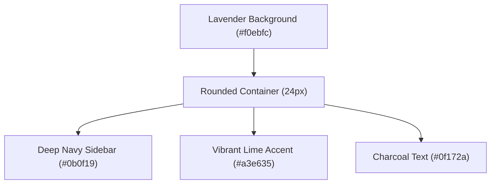

# LearnSphere LMS — Project Presentation

Welcome to the presentation of **LearnSphere**, a modern, premium, responsive Learning Management System (LMS) web application engineered with React.js and CSS3 variables.

---

## 🎨 Visual Identity & Branding

LearnSphere balances modern SaaS elegance with clear academic structuring. The color system has been custom-tailored to provide high readability and visual delight:



- **Background**: Soft lavender/purple wraps the layout to offer a welcoming, premium feeling.
- **Syllabus Container**: A large rounded white app container with subtle shadows holds page states.
- **Sidebar**: Dark navy vertical layout representing stability and professional command.
- **CTAs & Active Links**: Energetic lime green indicators with high-contrast dark text labels.

---

## 💻 Tech Stack & API Simulations

```
[React SPA Router] ──> [AuthContext (Session Sync)] ──> [LocalStorage Persistence]
       │
       └──> [useFetch Hook] ──> [Simulated JSON REST API (/api/courses.json)]
```

- **Frontend Core**: HTML5, CSS3, React.js (ES6+), Vite.
- **Route Guarding**: React Router DOM with customized `ProtectedRoute` verifying Student vs. Teacher session cookies simulated in `LocalStorage`.
- **State Syncing**: `AuthContext` provides dynamic logins, signup roles, profile edits, and created courses syncing seamlessly with LocalStorage.
- **Data Hook**: Custom `useFetch` simulates REST API fetching latency (`800ms`) with async/await promises fetching from `/api/courses.json`.

---

## 🚀 Key Functional Features

### 👨‍🎓 Student Workspace
1. **Interactive Dashboard**:
   - Dynamic **Statistics Cards** calculating overall progress and pending assignment count.
   - Reusable **Weekly Studying Activity Bar Chart** built entirely with pure CSS transitions.
   - Horizontal **Course Progress cards** with linear indicators.
2. **Interactive Quiz Engine**:
   - Start quizzes on demand, answer questions one by one with Prev/Next, submit answers, and receive score calculation percentages.
3. **Course Details Syllabus**:
   - Toggle module completion checkboxes, click "Continue Learning" to dynamically increase course progress levels, and download PDF study guides.
4. **Submissions Hub**:
   - Write notes or upload files to update assignments from *In Progress* to *Completed*.

### 👩‍🏫 Instructor Workspace
1. **Instructor Dashboard**:
   - Monitor total active students, average progress rates, and student submission logs.
2. **Course Creator Form**:
   - Create and publish new syllabus listings. Input title, description, category, and lessons with error validation checking.
3. **Student Roster Management**:
   - Table viewing list of registered students, current statuses, and course completion percentage bars.

---

## 📁 Component Organization Map

```
src/
├── components/          # Reusable visual components
│   ├── Button.jsx       # Custom primitive buttons
│   ├── ProgressBar.jsx  # SVG-driven progress indicators
│   ├── Sidebar.jsx      # Navigation drawer
│   ├── Navbar.jsx       # Header & Search
│   └── Modal.jsx        # Backdrop blurred overlays
├── pages/
│   ├── Login.jsx        # Validation & Show/Hide Password
│   ├── Signup.jsx       # Role selection registry
│   ├── student/         # Dashboards, Catalog, Quizzes, Notes
│   └── teacher/         # Creator, Student logs
└── context/
    └── AuthContext.jsx  # Global session management
```

---

## ⚙️ Running Locally

1. Install modules:
   ```bash
   npm install
   ```
2. Launch Vite local hot-reloading dev server:
   ```bash
   npm run dev
   ```
3. Compile optimized production bundle:
   ```bash
   npm run build
   ```
